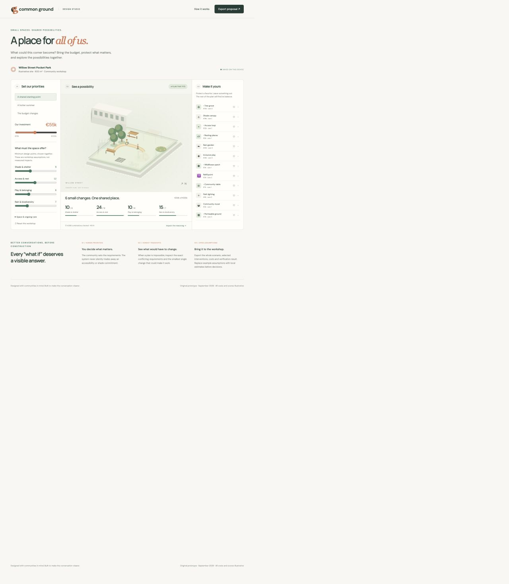
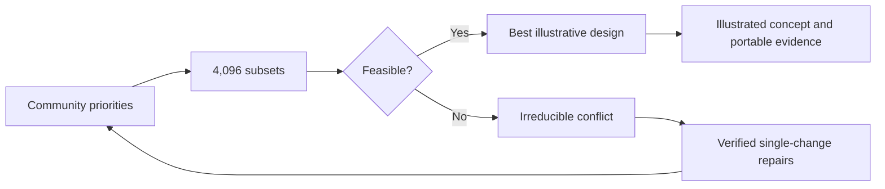

# Common Ground

**A place for all of us. An explanation for every tradeoff.**

Common Ground is a working participatory design studio for a small public space. Set the budget and minimum community priorities, protect a favorite intervention, and watch a feasible concept emerge. If the commitments cannot all fit, it explains the conflict and offers verified ways to repair it.

Built for the Graphiques Innovation Challenge, Architecture & Urban Innovation. Original development began September 21, 2026. This is a research and design prototype, not a construction plan.

[Open the live studio](https://toukoursin.github.io/common-ground/) · [Design and pilot proposal](DESIGN.md)



## Try the story

1. Open the studio. The illustrative €55k workshop has 145 feasible combinations.
2. Protect inclusive play. The system recomputes every choice while respecting that decision.
3. Choose **The budget changes**. At €30k, the original requirements conflict.
4. **Inspect the reasoning** to see an irreducible conflicting set.
5. Choose **Increase budget to €37k**. A plan becomes feasible without silently abandoning the community's original minimums.
6. Export the proposal. It includes every assumption, the chosen interventions, constraints, results and a verification certificate.

The exact visual plan is a concept drawing. Costs, spatial units, care units and design scores are explicitly illustrative. They are not validated community preferences, contractor quotes, engineering calculations, water/heat measurements, or predicted health benefits. Trees' eventual shade and a canopy's immediate shade must be distinguished in a real project.

## Run

Requires Node.js 22+; no npm dependencies, API keys or build step.

```sh
npm start
# http://127.0.0.1:4320
npm test
```

The app is also a static site: serve `index.html`, `style.css`, `app.mjs`, and `engine.mjs` from any HTTPS host. Google Fonts improves typography when available; system fonts are the offline fallback. Workshop state stays in browser localStorage. No analytics, accounts or remote AI calls.

## Why it exists

A public-space workshop often produces an attractive drawing without exposing which needs were traded away. Common Ground turns those choices into an inspectable conversation. The community supplies priorities; the bounded optimizer makes consequences visible.

WHO's review of urban green-space interventions emphasizes combining physical improvements with social engagement. That supports the participatory direction; it does **not** validate this prototype's scoring model or forecast its benefits. See [DESIGN.md](DESIGN.md) for research, the proposed operating model, an explicitly hypothetical pilot and limitations.

## How the engine works

Twelve interventions form a bounded domain of 2¹² = 4,096 subsets. Every subset is measured against:

- Budget, space and ongoing care caps.
- Minimum shade, access, play and water design points.
- Explicit protected and excluded interventions.

The objective is the equally weighted sum of design points. Ties prefer lower cost, then lower care, then a stable subset order. It is a transparent example preference function, not a learned or morally authoritative ranking.

If no subset works, deletion filtering extracts an **irreducible infeasible subsystem**. Removing any one member makes that subsystem feasible. This is not necessarily a minimum-cardinality conflict. Repairs then solve a different exact question: what is the least single cap increase or largest feasible reduced minimum that makes the **entire** constraint system feasible? Protected choices are never relaxed automatically.

`verifyCertificate` independently remeasures feasible selections and checks all constraints; for infeasible results it verifies unsatisfiability and deletion minimality. It does not certify real-world validity of the inputs. Tests compare the solver with a separate recursive enumeration across randomized scenarios, check protected/excluded choices, boundary cases, repair minimality, invalid inputs and tampering.



## Scope and next validation

No residents have been interviewed and no site has been surveyed for this prototype. The synthetic Willow Street site does not represent an actual funded proposal. Before use in a real project: obtain local costs and lifecycle estimates, audit accessibility with affected residents, model shade over time, inspect drainage/site conditions, and test whether explanations are understandable in an inclusive facilitated workshop. The fixed catalog is a prototype limitation; validated local catalogs and multilingual facilitation are next steps.

## Build inventory and AI disclosure

Vanilla JavaScript ES modules, SVG, CSS, HTML, Node.js built-in test and HTTP modules. DM Sans and Manrope via Google Fonts; system fallback. Original SVG illustration and synthetic intervention dataset created for this project. Codex (GPT-6) assisted concept development, implementation, tests, design, documentation and submission preparation. ElevenLabs synthetic narration is identified in the video credits when used. No generated content is represented as a user interview, field measurement, or sponsor endorsement.

MIT licensed. Team: Touko Ursin.
